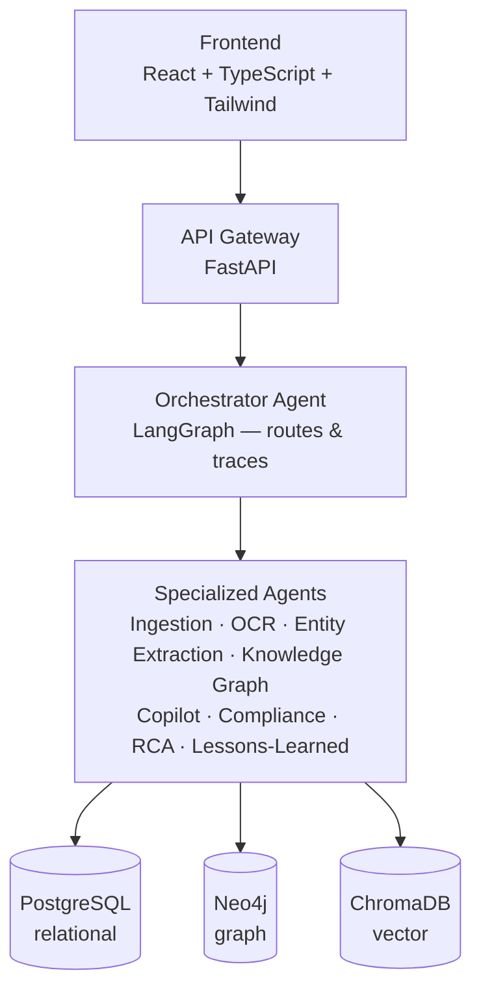
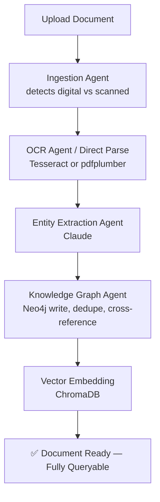
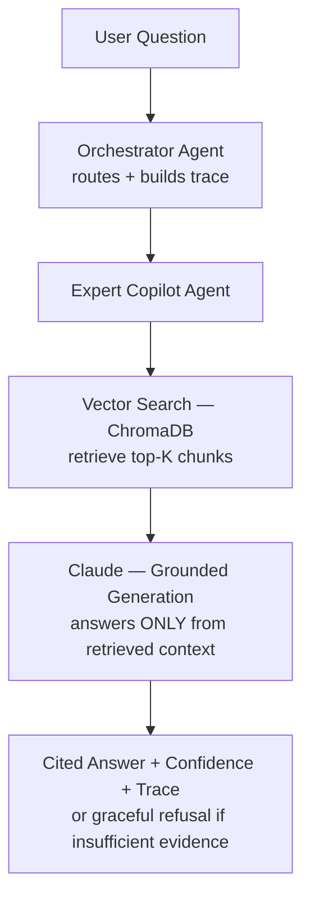
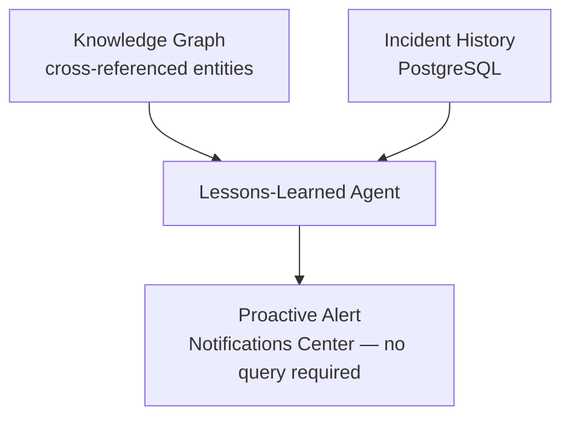

# OpsBrain
<<<<<<< Updated upstream
### Agentic Industrial Knowledge Intelligence Platform
**ET AI Hackathon 2026 — Problem Statement #8**

Team: Raghuvarshan & Kamalesh

---

## Overview

OpsBrain turns a plant's scattered industrial documents — engineering drawings, maintenance work orders, safety procedures, inspection reports — into a living, reasoning knowledge graph. A council of nine specialized AI agents ingests, connects, and reasons over that knowledge, answering questions with citations, catching compliance gaps before an audit does, and proactively warning engineers before a failure repeats itself.

## The Problem

Professionals in asset-intensive industries lose an estimated **35% of their working hours** searching for information that already exists somewhere in the organization, scattered across 7–12 disconnected systems. Meanwhile, **25% of India's experienced industrial engineers** will retire within a decade — taking decades of undocumented operational knowledge with them.

## The Solution

OpsBrain is not a search box. It's an agentic operations co-pilot that:

- Answers natural-language questions with cited, confidence-scored, hallucination-guarded responses
- Builds a live knowledge graph connecting documents, equipment, and entities automatically
- Checks every document against a regulatory corpus and flags coverage gaps
- Generates ranked root-cause hypotheses from historical incident data
- Proactively alerts engineers when a pattern repeats — before anyone has to ask
- Detects contradictions between documents automatically
- Logs every single agent action for full auditability

---

## System Architecture



## Document Ingestion Pipeline



## Query / RAG Flow



> The refusal path is deliberate — if retrieved context doesn't clearly support an answer, the Copilot says so explicitly instead of guessing. This is one of the platform's core trust features.

## Proactive Intelligence Loop



---

## Multi-Agent Reference

| Agent | Role | Talks To |
|---|---|---|
| **Orchestrator** | Routes requests via LangGraph, returns a step-by-step trace | All agents |
| **Document Ingestion** | Detects file type, routes to OCR or direct parsing | OCR Agent, Knowledge Graph Agent |
| **OCR** | Extracts text from scanned PDFs/images (Tesseract) | Document Ingestion Agent |
| **Entity Extraction** | Pulls structured entities via Claude (equipment, dates, personnel, standards) | Knowledge Graph Agent |
| **Knowledge Graph** | Writes/dedupes Neo4j nodes, tracks cross-references, detects contradictions | Copilot, RCA, Compliance Agents |
| **Expert Copilot** | RAG retrieval + cited, confidence-scored answers with hallucination guardrail | Orchestrator, Knowledge Graph Agent |
| **Compliance** | Maps documents against a regulation corpus via embedding similarity | Orchestrator, Knowledge Graph Agent |
| **RCA** | Ranks root-cause hypotheses from equipment incident history | Knowledge Graph Agent |
| **Lessons-Learned** | Proactively surfaces alerts from cross-referenced entities + incidents | Orchestrator (Notifications) |

---

## Key Features

**Core Pipeline**
- Multi-format document upload (PDF, scanned image, DOCX, XLSX)
- Automatic OCR for scanned/handwritten documents
- LLM-based structured entity extraction
- Live, interactive knowledge graph (Neo4j + force-directed visualization)

**Trust & Safety**
- Every answer cited down to the source document
- Confidence scores on every AI response
- Explicit hallucination guardrail
- Full audit trail of every agent action

**Proactive Intelligence**
- Unprompted alerts when a pattern of risk emerges
- Automatic cross-document contradiction detection
- Live "Explain this answer" agent trace

**Business Impact**
- Regulatory compliance gap detection with a visual coverage report
- Ranked, evidence-backed root-cause analysis
- Real-time ROI calculator — hours saved based on actual usage

---

## Application Screens

| Screen | Purpose |
|---|---|
| Login | Role-based authentication (Supabase Auth) |
| Dashboard | System status, live KPIs, real-time ROI |
| Upload Center | Drag-and-drop ingestion with live processing status |
| Expert Copilot | Conversational Q&A with citations and explainability |
| Knowledge Graph Explorer | Interactive graph, contradiction scan |
| Compliance Dashboard | Regulation coverage heat-map per document |
| Maintenance / RCA | Equipment lookup with ranked root-cause hypotheses |
| Notifications | Proactive pattern alerts |
| Analytics | Usage charts, agent activity, live audit trail |
| Settings | User and system configuration |

---

## Technology Stack

| Layer | Technology |
|---|---|
| Frontend | React + TypeScript + Tailwind CSS |
| Backend | FastAPI (Python) |
| Agent Orchestration | LangGraph |
| LLM | Claude (Anthropic API) |
| Relational DB | PostgreSQL (Supabase) |
| Graph DB | Neo4j AuraDB |
| Vector DB | ChromaDB |
| Auth | Supabase Auth |
| Charts | Recharts |
| Graph Visualization | react-force-graph-2d |
| Deployment | Vercel (frontend) · Render (backend) |

---

## API Reference

| Endpoint | Method | Description |
|---|---|---|
| `/api/health` | GET | Basic liveness check |
| `/api/db-health` | GET | Live PostgreSQL + Neo4j connection status |
| `/api/documents/upload` | POST | Upload and process a document end-to-end |
| `/api/documents` | GET | List all ingested documents |
| `/api/graph` | GET | Full knowledge graph (nodes + edges) |
| `/api/graph/cross-referenced` | GET | Entities appearing across multiple documents |
| `/api/graph/detect-contradictions` | POST | Scan for and flag conflicting information |
| `/api/copilot/query` | POST | Ask the Expert Copilot a question |
| `/api/compliance/check/{document_id}` | POST | Run a regulation coverage check |
| `/api/rca/{equipment_tag}` | GET | Get ranked root-cause hypotheses |
| `/api/alerts` | GET | Get current proactive alerts |
| `/api/analytics/summary` | GET | Aggregated usage statistics |
| `/api/analytics/roi` | GET | Hours-saved ROI estimate |
| `/api/audit-log` | GET | Recent agent action history |

---

## Getting Started

### Prerequisites
- Python 3.11+
- Node.js 18+
- A Supabase project (PostgreSQL + Auth)
- A Neo4j AuraDB instance (free tier)
- An Anthropic API key

### Backend Setup
```bash
cd backend
python3 -m venv venv
source venv/bin/activate
pip install -r requirements.txt
cp .env.example .env    # fill in your real credentials
alembic upgrade head
python -m app.scripts.seed_regulations
python -m app.scripts.seed_incidents
uvicorn app.main:app --reload --port 8000
```

### Frontend Setup
```bash
cd frontend
npm install
cp .env.example .env    # fill in your real credentials
npm run dev
```

### Run the Full Pipeline Test
```bash
cd backend
python tests/smoke_test.py test1.txt P-204
```

---

## Project Structure

```
opsbrain/
├── backend/
│   ├── app/
│   │   ├── agents/        # All 9 agents
│   │   ├── api/routes/    # FastAPI route handlers
│   │   ├── core/          # Config, logging
│   │   ├── db/             # Postgres, Neo4j, ChromaDB clients
│   │   ├── models/         # SQLAlchemy ORM models
│   │   ├── services/       # LLM, OCR, chunking, analytics, ROI services
│   │   ├── scripts/         # Seed data scripts
│   │   └── main.py
│   ├── alembic/            # DB migrations
│   └── tests/
│       └── smoke_test.py    # Full pipeline regression test
├── frontend/
│   └── src/
│       ├── components/      # Reusable UI (chat, graph, dashboard)
│       ├── pages/            # 10 application screens
│       ├── services/          # API client
│       └── lib/                # Supabase client
├── docs/
│   └── core-feature-summary.md
└── README.md
```

---

## Roadmap

- Native SAP/Maximo/CMMS integration connectors
- Computer vision P&ID auto-digitization
- AR overlay for field technicians
- Multi-plant / multi-tenant deployment
- Auto-generated training material from tribal knowledge
- Multi-language support for global plant networks

## Team

- **Raghuvarshan** — Backend, Agent Architecture, AI Pipeline
- **Kamalesh** — Frontend, UI/UX, Product Integration

## License

Built for the ET AI Hackathon 2026. License to be determined.
=======
# Back end : RAGHUVARSHAN V R
# Front end: KAMALESH S
>>>>>>> Stashed changes
